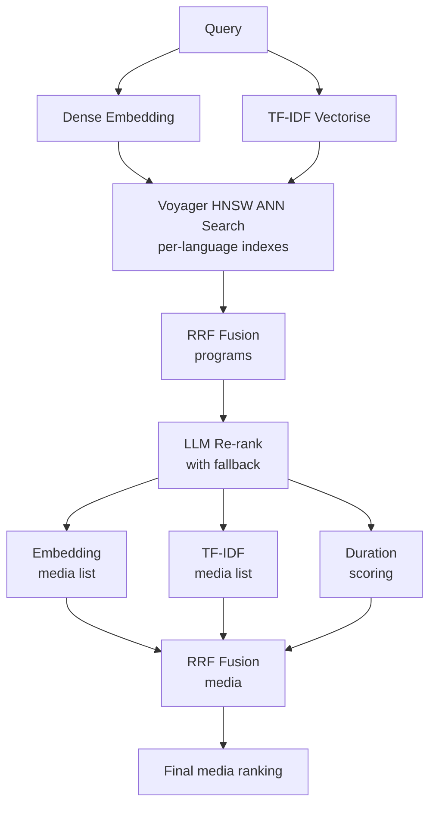

# hybrid-recsys


Multilingual content recommendation engine combining dual retrieval, Reciprocal
Rank Fusion, and LLM re-ranking.

---

## Architecture



**Pipeline in plain English:**

1. The query is embedded (dense vector) and TF-IDF vectorised (sparse) in
   parallel.
2. Both vectors are searched against per-language Voyager HNSW indexes, producing two
   ranked lists of programs.
3. The lists are merged via Reciprocal Rank Fusion.
4. An optional LLM re-ranks the fused list (falls back to RRF on failure).
5. For each top program the earliest episode is selected; those episodes form three
   ranked lists (embedding order, TF-IDF order, duration proximity score).
6. A second RRF pass over the media lists yields the final media ranking.

---

## Results

Measured on the 200-program synthetic catalog (1075 media items across `en`, `fr`, `de`).

### Latency

| Metric | Value |
|--------|-------|
| p50    | 10.5 ms |
| p95    | 15.8 ms |
| Max    | 35.3 ms |

Benchmarked over 200 queries, single-threaded, no LLM re-ranking, on macOS arm64 with `sentence-transformers/paraphrase-multilingual-MiniLM-L12-v2`. Latency is dominated by query embedding and HNSW ANN search.

### Retrieval Quality

Evaluated on 20 topic-based queries across `en`, `fr`, `de` (5 trilingual topics +
5 English-only topics), with relevance judged by whether a returned program's
topic matches the query topic.

| Metric    | @3    | @5    |
|-----------|-------|-------|
| Precision | 0.800 | 0.680 |
| Recall    | 0.655 | 0.847 |
| nDCG      | 0.932 | 0.940 |

nDCG near `1.0` indicates that relevant programs consistently rank at the top of
the returned list. Precision drops from `@3` to `@5` as extra slots fill with
off-topic items once the topic's relevant pool is exhausted; recall rises
correspondingly.

---

## Why This Design

- **Dual retrieval (dense + sparse) with RRF fusion** — runs both embedding ANN and TF-IDF, merges with Reciprocal Rank Fusion. _Dense embeddings miss exact keyword matches; TF-IDF misses semantic similarity. The combination reliably outperforms either alone._
- **LLM re-ranking with automatic fallback** — optional OpenAI (GPT) re-ranker, pluggable via the `LLMProvider` ABC; falls back to RRF order on timeout or parse failure. _Network latency and API errors are real in production. The system must return results even when the LLM is unavailable._
- **Voyager (HNSW) over FAISS** — single static file, no server process, pip-installable wheel. _Scales to ~10M items with minimal operational overhead. FAISS becomes relevant at 100M+ or when GPU acceleration is needed._
- **Per-language indexes** — separate HNSW + TF-IDF indexes per language. _Multilingual embedding models underperform monolingual ones on non-English content; per-language indexing avoids cross-lingual noise in retrieval._
- **Duration-aware scoring with asymmetric penalty** — penalizes results longer than requested more than shorter ones. _A product requirement: prioritize shorter-than-requested content over longer._

---

## Quick Start

> **Note:** First run downloads ~560 MB of models (3 spaCy + sentence-transformers). Allow 5-10 minutes on a typical connection.

```bash
# 1. Clone & install (one command installs all dependencies + language models)
git clone https://github.com/nlorber/hybrid-recsys.git
cd hybrid-recsys
make setup

# 2. Generate a synthetic catalog and build indexes
uv run python scripts/generate_catalog.py
uv run hybrid-recsys index

# 3. Run a demo query
uv run hybrid-recsys demo "true crime podcast" --lang en --size 3
```

<details>
<summary>Manual install (without Make)</summary>

```bash
uv sync
uv run python -m spacy download en_core_web_sm
uv run python -m spacy download fr_core_news_sm
uv run python -m spacy download de_core_news_sm
uv run python -m nltk.downloader stopwords
```
</details>

---

## API

Start the FastAPI server:

```bash
uv run hybrid-recsys serve
# Listening on http://0.0.0.0:8000
```

POST a recommendation request:

```bash
curl -s -X POST http://localhost:8000/recommend \
     -H "Content-Type: application/json" \
     -d '{"query": "science for kids", "lang": "en", "size": 3}' \
  | jq .
```

Example response:

```json
{
  "programs": ["prg_0042", "prg_0017", "prg_0091"],
  "medias":   ["med_00224", "med_00089", "med_00490"]
}
```

Interactive API docs: <http://localhost:8000/docs>

---

## Configuration

All settings use the `RECSYS_` prefix and can be set via environment variables or
a `.env` file:

```bash
RECSYS_EMBEDDING_PROVIDER=openai
RECSYS_EMBEDDING_MODEL=text-embedding-3-small
RECSYS_OPENAI_API_KEY=sk-...
RECSYS_LLM_PROVIDER=openai
```

See [docs/PROVIDERS.md](docs/PROVIDERS.md) for the full list of variables and
available providers.

---

## Architecture Details

See [docs/DESIGN.md](docs/DESIGN.md) for:

- Full RRF formula with parameter explanation
- Duration scoring formula and asymmetric penalty rationale
- Voyager (HNSW) vs. FAISS / ScaNN trade-off analysis
- Indexing strategy and provider abstraction design

---

## Tests

```bash
# All tests
uv run pytest

# Unit tests only
uv run pytest tests/unit

# Integration tests only
uv run pytest tests/integration
```

---

## Tech Stack

| Layer | Library |
|---|---|
| Embeddings | sentence-transformers / OpenAI |
| Sparse retrieval | scikit-learn TF-IDF |
| ANN index | Voyager (HNSW) |
| NLP tokenisation | spaCy |
| Re-ranking | OpenAI (optional) / Mock |
| API server | FastAPI + Uvicorn |
| CLI | Typer |
| Config | pydantic-settings |
